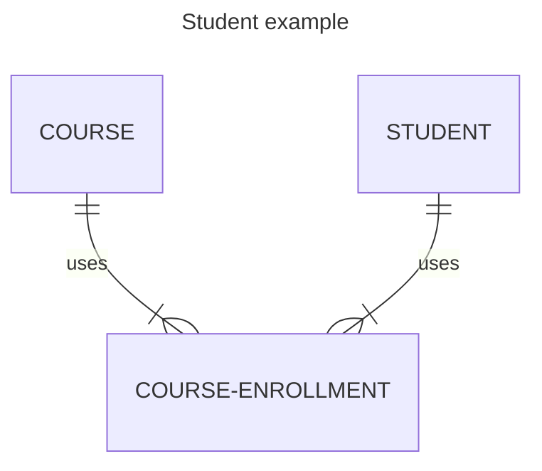

### Relational database
table

| rhodes id | preferred name | email               |
| --------- | -------------- | ------------------- |
| r03372837 | James          | jamre-34@rhodes.edu |
| r02938418 | Alice          | alier-24@rhodes.edu |
| r02342341 | Bryce          | brywp-26@rhodes.edu |
|           |                |                     |

| rhodes id | course id |
| --------- | --------- |
| r03372837 | comp 485  |
| r03372837 | comp 251  |
|           |           |
|           |

Sprint Data JPA
Object Relational Mapping
	Not a class, but specifies relationship between objects
	JPA - interface that specifies entity relational mapping 
	Jakarta Persistence API
	Hibernate implements JPA
		an implementation of ORM, following the JPA standard
		JPA comes with spring
	At runtime, spring uses annotations to override 
```java
@entity
//type name
@id 
//primary key
@Column
//

public static void main(String[] args) {SprintApplication.run(DemoApplication.calss, args); }
//inversion control, spring controls the app
```




| --------- | ----------- | ------------ |
| comp 485  | senior sem  | 4            |
|           |             |              |

make sure it references the previous table


constraints on the columns 
	can't be null

Data types
	Numeric --> Integer, Real
	Date --> date, time, timestamp
	Char --> char (fixed length) , varchar (variable length, dynamic memory)
	Binary --> audio, images, blob(random access types), varbinary

Keys
	1. Primary key
		Uniquely identify the rows of the table, enforce uniqueness. 
		composite primary, 
		natural 
			id is the value of an attribute, hopefully unique
		artificial
			use sequence generator, always unique, unrelated to some attribute
	1. Foreign key
		Link to data in another table
		Referential integrity, making sure the the thing the foreign key reeferes tp  actually exists in the other table


### PostgreSQL
Open relational database 

``` bash
psql.exe --username=postgres

\? 
\l 
\du+
create foreign keys, 
crerate table > wizard 
constraints tab > add foreign key
given names > select colun from table > what the referencing table is
SQL is a functional language, not imperative

```

```sql
INSERT INTO students (rhodes id, preferred name, email)
VALUES ("r034950293", "james mcgeegan", "jamcd-20@rhodes.edu"),
	("r034950293", "james mcgeegan", "jamcd-20@rhodes.edu"),
	("r034950293", "james mcgeegan", "jamcd-20@rhodes.edu")

select * 
from students;
#returns a list

select rhodesid, preferred name /*which column you want*/
from game /*what table to select from*/

UPDATE students 
SET preferred_name = 'Robert barker'
WHERE rhodes_id = "r023423423"


DELETE FROM students
where rhodes_id = ''
where rhodes_id list 'r0%'
and preferred_name = ''
order by preferred_name desc /*asc*/

select player, sum(player)
from game 
group by player

select *
from game a inner join goal g 
on a.id = g.matchid


```

https://sqlzoo.net/wiki/The_JOIN_operation

begin and end 
temporary changes


# Rest API

GET - read
POST - create
PUT - update
DELETE - delete

scalable - stateless
	can keep adding servers
simple, standardized interface design

Spring MVC
	front and back controller
		front controller generates view from view templates
		controller handles request from models, and process request 
	database communicate with model through ORM


# Spring
Sprint initializer
model classes
	student
controllers
	root controller
	student controller
add request mappings to controller methods


```java
@RestController
@GetMapping
@PostMapping
```


