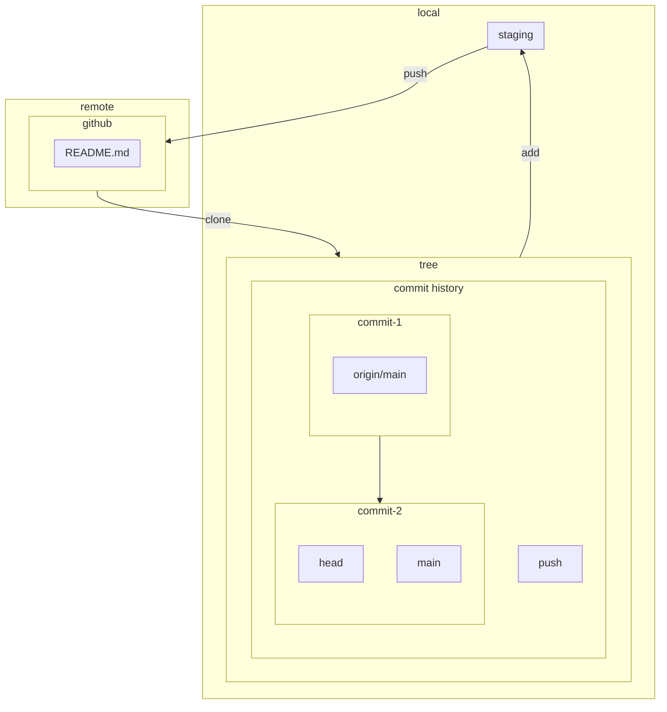

Need to change software over time, to scale, increased risk

Tools and practices, design patterns, policies

“Software engineering” differs from “programming” in dimensionality: programming is about producing code. Software engineering extends that to include the maintenance of that code for its useful life span.

There is a factor of at least 100,000 times between the life spans of short-lived code and long-lived code. It is silly to assume that the same best practices apply universally on both ends of that spectrum.

Sustainability
	Software is **sustainable** when, for the expected life span of the code, we are capable of responding to changes in dependencies, technology, or product requirements. We may choose to not change things, but we need to be capable. Capability to make change

<div class="def"><b>Hyrum's Law</b>
<span class="cm-hashtag cm-hashtag-end cm-meta cm-tag-def">#def</span>
<br>with a sufficient number of users of an API, it does not matter what you promise in the contract: all observable behaviors of your system will be depended on by somebody.

</div>

Every task your organization has to do repeatedly should be scalable (linear or better) in terms of human input. Policies are a wonderful tool for making process scalable.

Process inefficiencies and other software-development tasks tend to scale up slowly. Be careful about boiled-frog problems.

Expertise pays off particularly well when combined with economies of scale.

“Because I said so” is a terrible reason to do things.

Being data driven is a good start, but in reality, most decisions are based on a mix of data, assumption, precedent, and argument. It’s best when objective data makes up the majority of those inputs, but it can rarely be all of them.

Being data driven over time implies the need to change directions when the data changes (or when assumptions are dispelled). Mistakes or revised plans are inevitable.


### Centralized VCS
CVS
RVS
subversion

### Effective Debugging
1. Start with a clean build of the correct version of the code
2. Create a test case that reproduces the issue
3. Carefully read the error message/ understand bad behavior
4. What changed??!, Binary cut
5. Use debugger to identify source  of issue
6. Fix the issue 
7. verify the fix with previous test cases, run regression test
8. reflec on what happened, could this be an issue elsewhere in the Code,

# Branched Based
## Git
Working Tree
Head
Detached head
https://www.cloudbees.com/blog/git-detached-head
```
mkdir git-head-demo  
cd git-head-demo  
git init  
touch file.txt  
git add .  
git commit -m "Create file"  
echo "Hello World!" > file.txt  
git commit -a -m "Add line to the file"  
echo "Second file" > file2.txt  
git add .  
git commit -m "Create second file"
```
reattach
```
git checkout master
git push
```
index
branch
fast-forward
	basically a merge that git automatically does

# Trunk Based
- Always off master 
1. Pull stuff down from remote
2. Modify stuff in local file system
3. Stage changes in local
4. commit changes in local
5. push to remote




* when pushed, origin/main becomes the newest commit*

![[Git]]
[[Software Development Life Cycle]]

Waterfall model
	old
	always wait for the previous people
	everything is planned very carefully
	old software development in punch cards
Iterative development
	always do small feature sets
	don't need to finish the whole thing
	cyclical
	keep iterating over the same phase, it's small time chunks

individuals, expectations and thus software should change and adapt over time

Always a refining of a prototype, always go back iteratively to what the users want


shift towards user stories, shorter requirements documents 
policy vs requirement, 
phrase requirements with variables, ex "only people in these two departments and manages have access, vs only authorized users have access"


# Epics (project)
[[User Stories]]
- Conceptual Knowledge:
    -  SDLC
    -  [[Software Development Life Cycle]]
	list the phases
		concept, requirements, analysis, design/ architecture, implementation, testing
	differences between waterfall vs. __iterative vs. agile___
		waterfall needs every step to be complete before moving on, whole thing planned out, when very failure avoidant
		iterative is does small feature sets, small time chunks, cyclically, don't need to finish the whole thing
		agile is an iterative development methodology, focusing on adapting to change, less focus on fine tuning
questions about the agile manifesto
[[User Stories]]

```
Our highest priority is to satisfy the customer  
through early and continuous delivery  
of valuable software.

Welcome changing requirements, even late in  
development. Agile processes harness change for  
the customer's competitive advantage.

Deliver working software frequently, from a  
couple of weeks to a couple of months, with a  
preference to the shorter timescale.

Business people and developers must work  
together daily throughout the project.

Build projects around motivated individuals.  
Give them the environment and support they need,  
and trust them to get the job done.

The most efficient and effective method of  
conveying information to and within a development  
team is face-to-face conversation.

Working software is the primary measure of progress.

Agile processes promote sustainable development.  
The sponsors, developers, and users should be able  
to maintain a constant pace indefinitely.

Continuous attention to technical excellence  
and good design enhances agility.

Simplicity--the art of maximizing the amount  
of work not done--is essential.

The best architectures, requirements, and designs  
emerge from self-organizing teams.

At regular intervals, the team reflects on how  
to become more effective, then tunes and adjusts  
its behavior accordingly.
```

[[System Architecture and Design]]


[[Software Engineering/Review]]

# Kanban Board
prioritization
	top to bottom by priority, what to do first
work in progress limits 
	limit on how many things can be out of the backlog 
	can block until everyone finishes a task
moving work 
	do something you have the capacity to, don't assign other people work
sort things in the backlog
planning poker - starts a conversation if there's disagreements on the weight of the task
more github continuous integration, regression test cases, change didn't break old work, has workflow with github, merge and check - in kicks off test cases, demos in class, code coverage analysis. 
test driven development - copilot 
weighted shortest job first
	when something is short and small, has a decent value to it, do that one because it's easy

#### trello 


| Backlog            | Answer (2)  (in progress) | Validate (2) | Done (2) |
| ------------------ | ------------------------- | ------------ | -------- |
| overview of kanban | prioritization            |              |          |
| roadmap of class   |                           |              |          |
| trello             |                           |              |          |
|                    |                           |              |          |

| Backlog | Answer doing | Answer done | Validate doing | Validate done | Done (2) |
| ------- | ------------ | ----------- | -------------- | ------------- | -------- |
|         |              |             |                |               |          |

 can split each section into doing and done
 done means the next phase hasn't begun yet
 

Full stack w/ spring
Final project: 
figure out user story and epics 
dependencies and frameworks
what features are necessary and what are nice to have
roadmap and milestones timeline

[[Testing]]

[[Databases]]