## System Diagram

Ex. 
Database to store messages
App/ browser
web server
API gateway

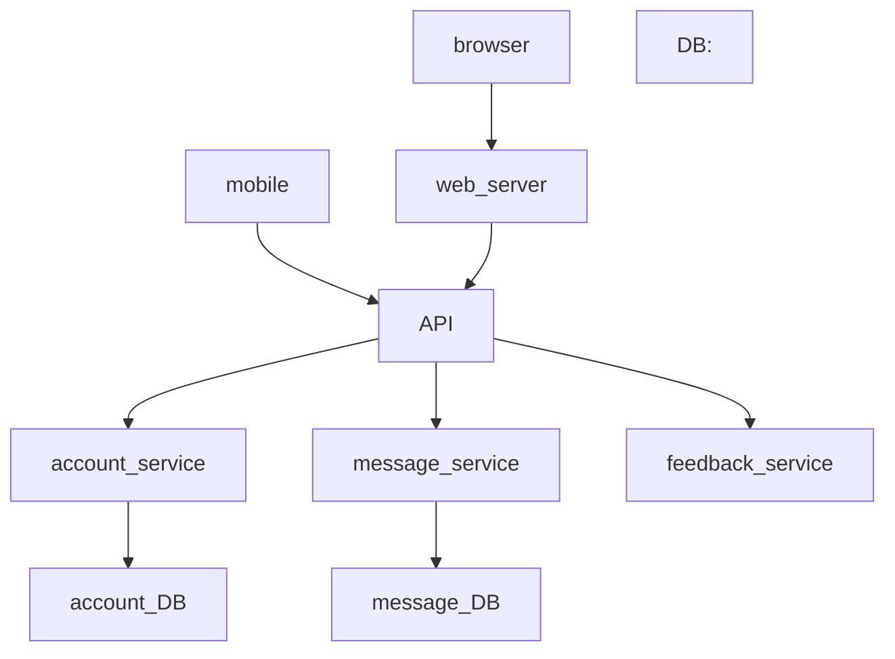

## Sequence diagram
![[Pasted image 20231010145559.png]]

made of loops and alt

alt - like if else branches 
loop - repeat blocks

SD edit, functions specify transitions


## Flow Chart

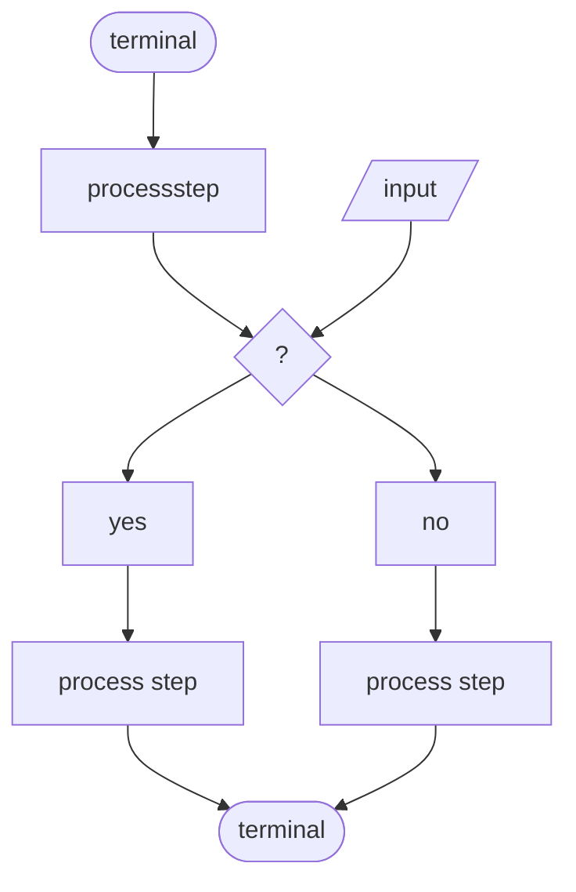


## Model View Controller (MVC)
1. well defined boundaries, separation of concerns
2. easy to change
3. multiple presentation styles, easy to support

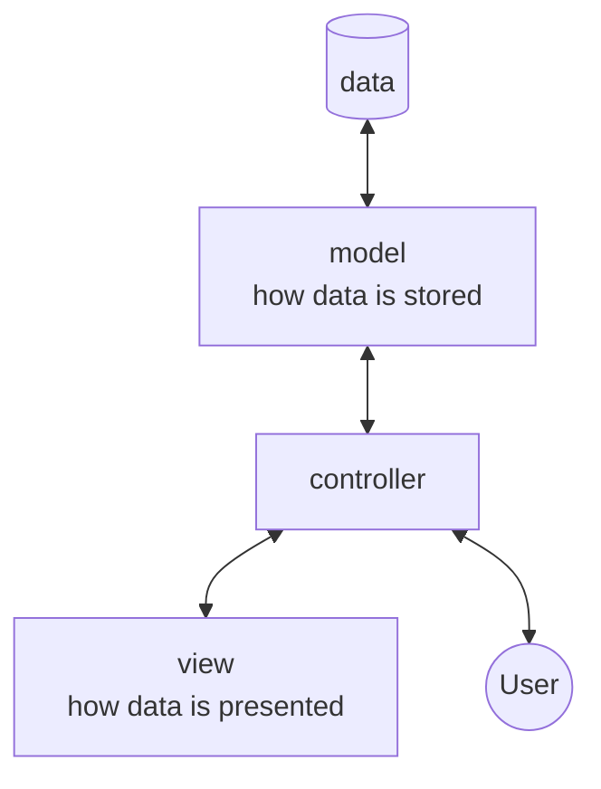


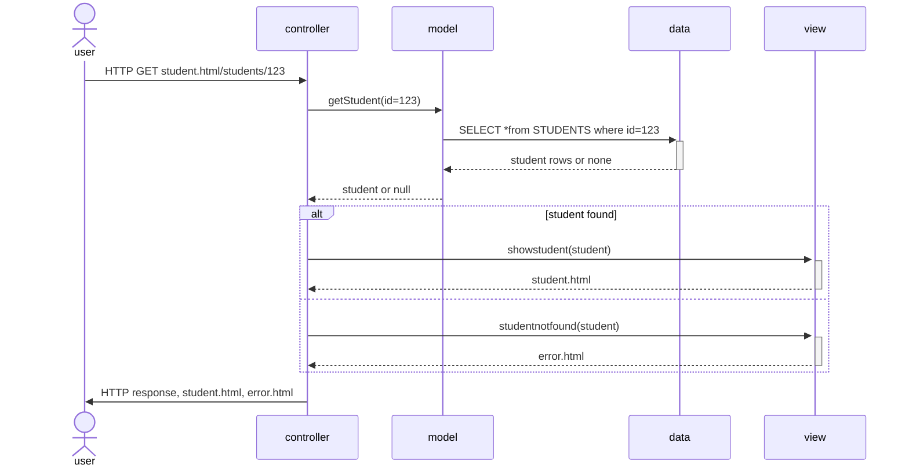

## UML Class Diagrams

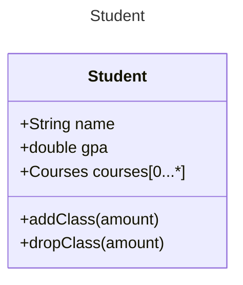

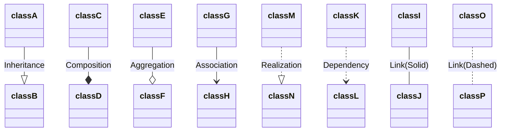

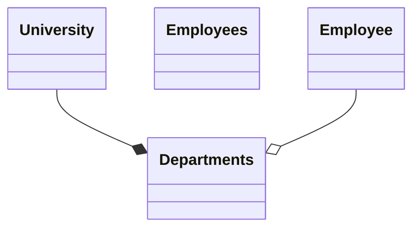


###### Multiplicity
	1
	1...3
	0...*
	1...*

###### Access Modifiers
	+ public
	- private
	# protect
	~ package
	Class [0...*]

Inheritance (Is a type of)
	Causes coupling 
Composition (Is made of)
Aggregation (Contains, has)
	**composition**: university is composed of departments, but departments cannot exists without a university
	**aggregation**: department is aggregation of employees, but employees can exist outside of a department
Association (can invoke a behavior, can call a method)

# Design Principles
1. Favor composition "has a" over "is a", composition over inheritance
2. Program to an interface not an implementation
3. Identify parts of your code that stay the same and those that are likely to change and isolate them from one another


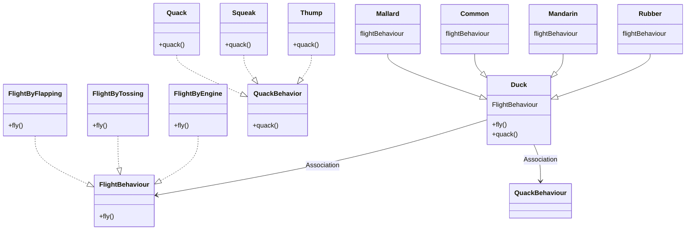


# Observer
Publisher and subscribers of data
Subject and Observer 

subject
	allow me to notify observer when there's change
observer 
	detailed implementation on what type of data to ask for
	list of observers

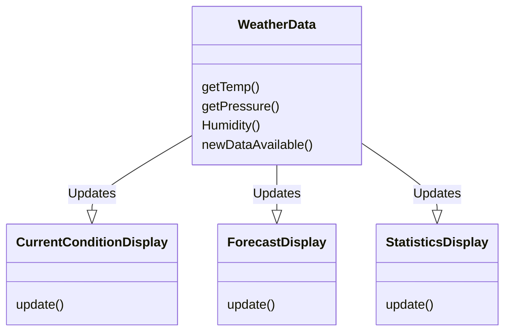

``` java
public class WeatherData(){
	private Display currentConditions //concrete classes
	private Display statistics 
	private Display forcast
	
	public void newDataAvailable(){
		float temp = getTemperature()
		float humidity = getHumidity()
		currentCondition.update(temp, humidity)
		statistics.update(temp, humidity)
		forecast.update(temp, humidity)
	}
} 
```

```java

```
# Decorator

have to change boolean for everything, then cost and description needs to be changed everytime
``` java
class Beverage{
	Boolean nonfat
	Boolean decaf
	Boolean extrafoam
	public Double getCost(){
	
	}
	public String getDescription(){
	
	}
	
}
```


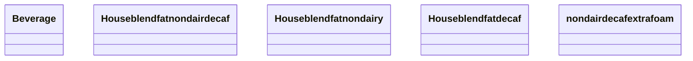

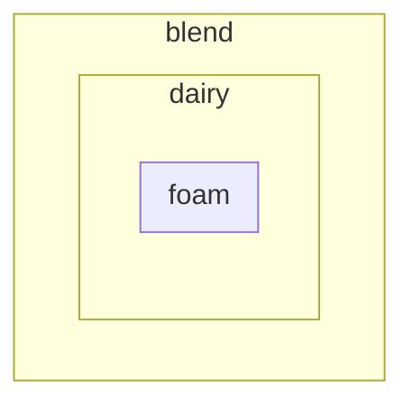

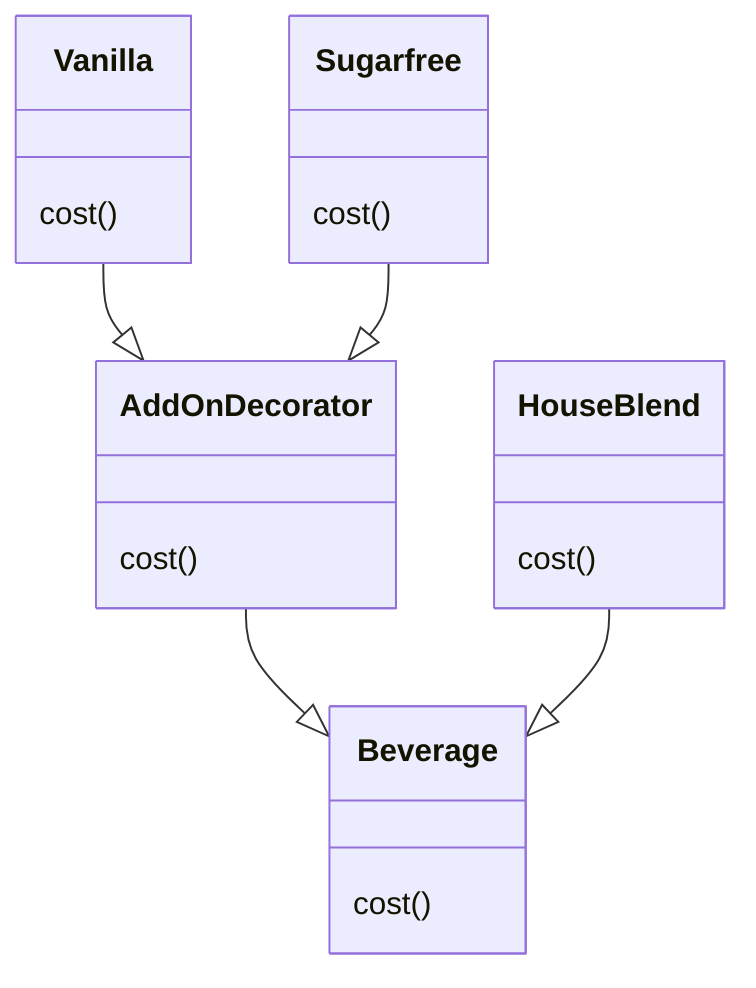

```java
Beverage hb = new HouseBlend()
Beverage hbsugarfree = new Sugarfree(hb)

```


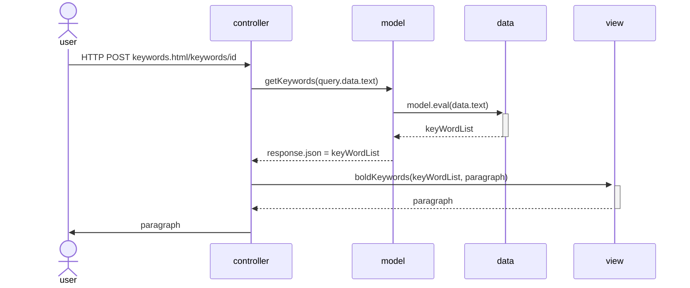
