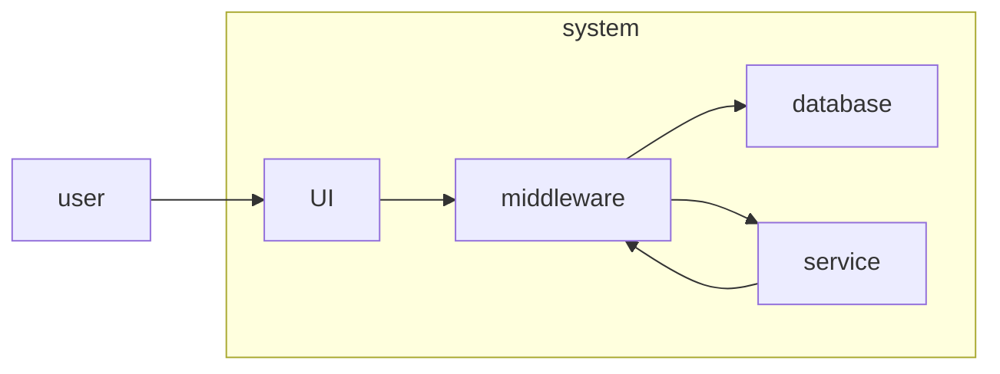

finding bugs
validate that software meets requirements
break the software
	the what is right but the how is wrong
Therac-25 accidentally supplied too much radiation due to a race condition

Bugs
	syntax
	logic
	runtime
	concurrency - time based
	integration
	performance
	configuration
	security
	user interface, user experience

starship troopers lol

functional 
	making sure requirements are satisfied
	what
non functional 
	how
	security, stability, performance, usability, scalability, experience

white box 
	know the code
	unit testing
	code coverage analysis
	[code coverage](#coverage)
	private - shouldn't be accessible, don't need to be tested in white box
	don't do globals
		**independent** of one another 
		**isolated** system
black box
	don't need to know the code

unit 
	white box
	methods or functions, done by developers, smallest unit of testing
integration
	pieces of overall system work together
system

user>UI>middleware>database>service>service

create a test directory
JUnit 
fixture - before and after common skeleton for test cases, that framework manages
setup 
enter test
leave test
teardown 

# Code coverage

really doesn't matter if it's public and private
have to figure out how to through testing of public methods test all lines in private methods
metrics 
	class - pretty straightforward
	method - count all methods, public and private
	lines - just take the number of lines, can count the curly braces in
	branches - 
		how many different options there are for an if statement, true false
		count up all the if statements
		while loops count as branches, inside is 1, break is the other 
			even if short circuit it doesn't really matter, just count all the conditionals
		if statements, loops, switch statements, ternary operators
		
		

regression testing
	every time you make changes to the program you run the same suite of tests

Be able to explain the difference(s) between **functional** and **non-functional** testing.
Be able to explain the difference(s) between **white-box** and **black-box** testing
Be able to explain the difference(s) between unit, integration, and system testing.
What is unit testing, and who typically does it?
What is a "unit"?
Is unit testing a type of white-box or black-box testing?
What is code coverage analysis?
When do you use it? (What is it good for?)
Be able to describe what class, method, line, and branch coverage mean.
Be able to calculate the class, method, line, and branch coverage percentages for a simple code example.
Is your code guaranteed to be free of bugs if you have 100% coverage?
Why or why not?