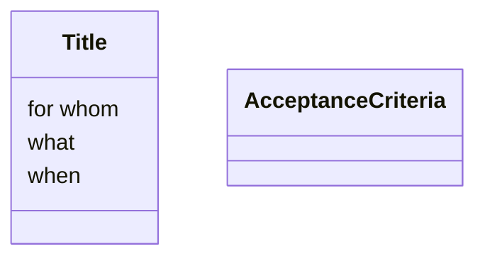

compare user stories to traditional requirements
	they are shorter and smaller, fit in an index card
	**a statement of need** and how to **satisfy that need**
standard template
	as a ------, I want to -----  so that I can ----
questions they do and don't answer
	who, what, why, 
	how, when
acceptance criteria
	given --(circumstance)-- when --(action)--- (then) ------
	priority
	story points
	level of effort
	how uncertain the direction is
	risk of doing and not doing
EPIC vs. User Story vs. Task
	Epic collection of > user story made up of> task

Applied Knowledge:
    writing user stories from descriptions
	    as a ----, I want to ---, so that I can ---- 
	evaluating user stories
		Independent
		Negotiable
		Valuable
		Estimable
		Small
		Testable
	splitting user stories
		workflow steps
		acceptance criterial 
		happy/sad path
		role/ persona 
		breadthwise decomposition

   (separating into specifics)

### User Story
As a (user)
I want to (do something)
So that I can (benefit in some way)
Write requirements here
what why who 
	not when and how

Title
	for whom
		as a user
	what
		I want to
	when
		so that I can
Acceptance Criteria
	priority
	story points
	level of effort
	how uncertain the direction is
	risk of doing and not doing
##### Task 
small things that help build the user story
###### Writing good user stories
Common mistakes
	too much details
	too technical
	too large 
	writing incorrect whys 
	example: 
		I want to filter my search results so that I see less  results.
		^  doesn't show reason
		I want to filter my search results so that I see the product I'm interesting in buying 
	using conjunctions
	example: 
		as a customer, I want to print/ copy/ email/ save coupons so that they are available to me and my family when we go shopping
		^ too many conjunctions, (ands)
		as a customer, I want to *share my coupons* so that they are available to others
	using stories as contracts

	Independent
		story can be done in any orter with respect to other stories
	Negotiable
		stories should be conversation starters, not over constraining the solution
	Valuable
		brings value to the customer if implemented
	Estimable
		can determine relative difficulty and challenges of the story
	Small
		can be completed quickly, within one iteration
	Testable
		can validate somehow that story was completed

#### Splitting user stories
1. workflow steps
2. acceptance criteria
3. happy/ sad path
4. happy/ unhappy path
5. roles or personas
6. breadthwise decomposition
### Example
As an online patron of XYZ
I want to pay for the items in my cart 
so that I can get items delivered when I need them.

###### Workflow: 

New story #1
As a user
I want to view the items in my cart
so that I can select I want to purchase

New story #2 
As a user 
I want to select a payment option
so that I can choose the most convenient payment method

New story #3
As a user
I would like to select a delivery address 
so that I can get the objects at my home

Breaking it down into parts of the workflow

###### Acceptance Criteria
1. I can see my reward balance
2. I can select the number of points to use for a purchase
3. I can see the discounted purchase price after applying the reward points

Each one of these can become their own user story

###### Happy and Sad Path
As a bank client I want to log in to my account so I can securely view my account details
Sad path, when things go wrong, 
Happy path, when things go right. 

I want to be able to recover my password

## Example: 
Y! 
as a consumer I want to save posts so that I can come back to them 
as a blogger, I want to publish small posts so that I can share my thoughts
as a consumer, I want a clean feed so that I can enjoy scrolling
as an advertiser, I want y!'s content to be clean, so that my brand identity can be intact
as an employee, I don't want to manually flag posts, so that I can spend time developing other things 
as a twitter hater, I want to make twitter suck, so that I can claim superiority

as a government entity, I want to have a checkmark so that I can know that my posts are verified

as a social media user I want the content moderator to show flagged posts on twitter